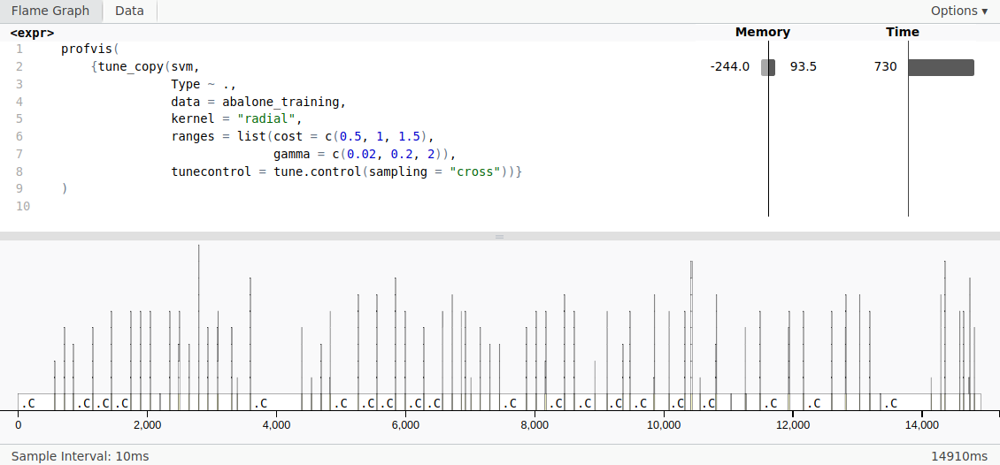
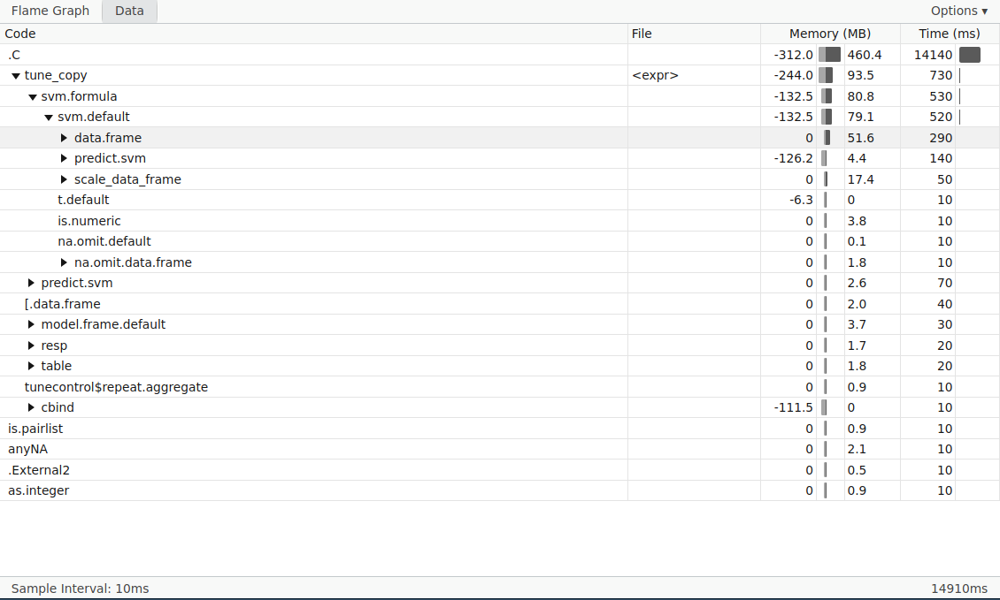

```{r setup, include=FALSE}
knitr::opts_chunk$set(echo = TRUE)
```

In this assessed coursework, I use profiling to identify inefficiencies in the `tune` function of the `e1071` package, particularly focusing on its application to tune support vector machines. The coursework primarily focuses on profiling and common R functions such as vectorisation to improve performance.

## Support vector machines

Support vector machines (SVMs) are a classification technique that works to find the optimal decision boundary between classes. To do so, they find the decision boundary with the thickest error margin possible. In situations where perfect classification accuracy on the training data is not possible, as with most real-world datasets, SVMs solve the soft margin problem to find the decision boundary $f(\mathbf{x}; \mathbf{w}) = 0$ in order to minimise $$\lVert \mathbf{w} \rVert^2 + \sum_i \epsilon_i$$ subject to the constraints that, for all $i$, $$y_i f(\mathbf{x}_i; \mathbf{w}) + \epsilon_i \geq 1, \epsilon_i \geq 0$$

Finding a solution to this constrained optimisation problem is difficult for high-dimensional datasets, and these constraints are relatively complex. The primal SVM problem can be reformulated into the dual problem using Lagrange multipliers. The dual problem simplifies the optimization process and allows for the computation of the support vectors without explicitly finding the high-dimensional vector $\mathbf{w}$ in the primal space. The dual problem also enables the use of kernel functions, allowing SVMs to handle non-linear separations efficiently.

### SVM hyperparameters

SVMs rely on the use of several hyperparameters, depending on the use of kernel function. All SVMs use the cost hyperparameter $C$, which controls the trade-off between minimising errors on the training data and controlling the complexity of the model. This hyperparameter $C > 0$ comes into the primal problem such that the decision boundary minimises $$\lVert \mathbf{w} \rVert^2 + C\sum_i \epsilon_i$$

SVMs can also use a variety of kernel functions, which can introduce additional hyperparameters. For instance, if using a radial basis kernel function $$k(\mathbf{x}_i, \mathbf{x}_j) = \exp(-\gamma \lvert \mathbf{x}_i - \mathbf{x}_j \rvert^2)$$ one must also specify the value of the bandwidth $\gamma$.

These hyperparameters should be tuned in order to find the values that yield the best performance. There are several methods for hyperparameter tuning, most notably cross-validation.

## `e1071` package

The `e1071` R package is commonly used for implementing SVMs in R. Here is an example application on a dataset of penguin species. We use an SVM with a linear kernel ($C = 1$) to predict the penguin species using data about the bill length, bill depth, flipper length, and body mass:

```{r message = F}
library(tidyverse)
library(e1071) # svm package
library(palmerpenguins) # data package
library(caret) # ML package

# Filter to 2 penguin species for binary classification
adelie_gentoo <- penguins %>% 
  filter(species %in% c("Adelie", "Gentoo")) %>% 
  mutate(species = droplevels(species)) %>% 
  filter(!is.na(bill_length_mm))

# Create training / test split
set.seed(999)
index <- createDataPartition(adelie_gentoo$species, p = 0.7, list = FALSE)
# Training data
penguin_training <- adelie_gentoo[index,] %>% 
  select(species,
         ends_with("_mm"),
         body_mass_g)
penguin_testing <- adelie_gentoo[-index,] %>% 
  select(species,
         ends_with("_mm"),
         body_mass_g)

# Train a Support Vector Machine (SVM) model
penguin_svm_model <- svm(species ~ ., data = penguin_training, kernel = "linear", cost = 1)

# Make predictions on the test set
penguin_svm_predictions <- predict(penguin_svm_model, newdata = penguin_testing)

# Evaluate the model performance
table(penguin_svm_predictions, penguin_testing$species)
```

We achieve 100% classification accuracy on the penguin dataset.

Let's try on a larger dataset of abalone data. This example predicts sex of abalones using some variables pertaining to the dimension of their shells. We now use an RBF kernel ($C = 1, \gamma = 0.2$:

```{r}
library(AppliedPredictiveModeling)
data("abalone")

mf_abalone <- abalone %>% 
  select(-Rings) %>% 
  filter(Type %in% c("M", "F")) %>% 
  mutate(Type = droplevels(Type))

# Create training / test split
set.seed(999)
index <- createDataPartition(mf_abalone$Type, p = 0.7, list = FALSE)
# Training data
abalone_training <- mf_abalone[index,]
abalone_testing <- mf_abalone[-index,]

# Train a Support Vector Machine (SVM) model
abalone_svm_model <- svm(Type ~ ., data = abalone_training, kernel = "radial", cost = 1, gamma = 0.2)

# Make predictions on the test set
abalone_svm_predictions <- predict(abalone_svm_model, newdata = abalone_testing)

# Evaluate the model performance
abalone_conf_matrix <- table(abalone_svm_predictions, abalone_testing$Type)
abalone_accuracy <- sum(diag(abalone_conf_matrix)) / sum(abalone_conf_matrix)
cat("Accuracy:", abalone_accuracy, "\n")
abalone_conf_matrix
```

We have poorer performance on this larger dataset. Let's see if tuning the hyperparameters using cross-validation helps.

### Tuning in `e1071`

The `e1071` package has a `tune` function that tunes hyperparameters using a grid search. We can supply several values for the hyperparameters $C$ and $\gamma$ and `tune` will yield the model with the hyperparameters that performed best, as measured by classification error:

```{r}
tictoc::tic()
abalone_tuned_svm <- tune(svm,
                          Type ~ .,
                          data = abalone_training,
                          kernel = "radial",
                          ranges = list(cost = c(0.5, 1, 1.5),
                                        gamma = c(0.02, 0.2, 2)),
                          tunecontrol = tune.control(sampling = "cross"))
tictoc::toc()
```

Note that running `tune` on these 9 parameter combinations (3 values of $C$ $\times$ 3 values of $\gamma$) was relatively slow. We will see why momentarily. We can now examine the parameters that gave the lowest classification error out of the combinations tried, and then test the best model on our testing data.

```{r}
abalone_tuned_svm$best.parameters

# Make predictions on the test set
tuned_abalone_svm_predictions <- predict(abalone_tuned_svm$best.model, newdata = abalone_testing)

# Evaluate the model performance
tuned_abalone_conf_matrix <- table(tuned_abalone_svm_predictions, abalone_testing$Type)
tuned_abalone_accuracy <- sum(diag(tuned_abalone_conf_matrix)) / sum(tuned_abalone_conf_matrix)
cat("Accuracy:", tuned_abalone_accuracy, "\n")
tuned_abalone_conf_matrix
```

We have slightly improved accuracy on the new values of the hyperparameters, which use a higher bandwidth value, but performance is still poor. Trying more combinations of $C$ and $\gamma$ is incredibly slow and computationally intensive, however, because of the structure of the `tune` function.

## Profiling `tune`

We can use profiling to determine what is causing the slow performance of `tune`. I copied the source code for `tune` from [here](https://github.com/cran/e1071/blob/master/R/tune.R) into `e1071_tune_copy.R` to explore what's going on within the function:

```{r eval = F}
library(profvis)

profvis(
  {tune_copy(svm,
             Type ~ .,
             data = abalone_training,
             kernel = "radial",
             ranges = list(cost = c(0.5, 1, 1.5),
                           gamma = c(0.02, 0.2, 2)),
             tunecontrol = tune.control(sampling = "cross",
                                        cross = 10))}
)
```

The profiling results look like this:  

```{r}
profvis(
  source(here("R/tune_application.R"))
)
```

By digging into the source code, we can see that `tune` contains 3 for loops nested within one another:

1. Looping over each parameter combination (9 in total in the example above)
2. Looping over each training sample (10 in the example since we performed 10-fold cross-validation)
3. Looping over the number of times training is repeated (1 in our example since `nrepeat = 1` by default)

